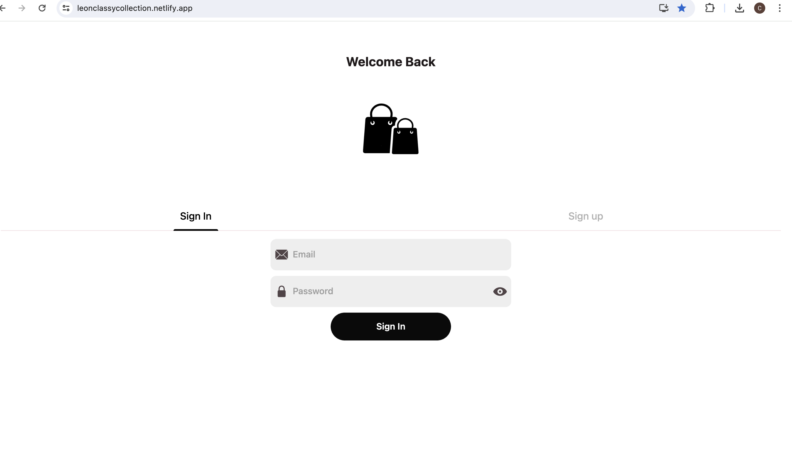
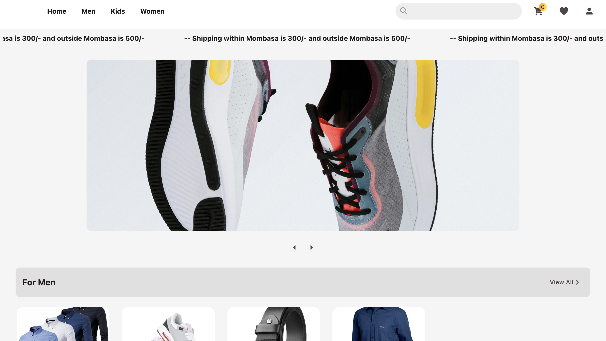
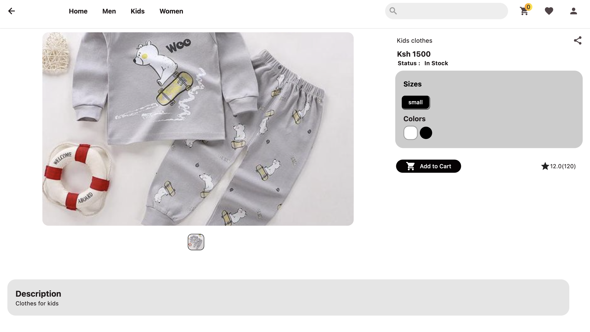

# Leon Classy Collection

## An ecommerce webapp made with flutter

This webapp made with flutter is an ecommerce app for LeonClassyCollections to help them reaching a wide range of customers through online shopping. With its user friendly nature its easy for users to shop and have a great online shopping experience.

## Key Features
* User friendly Interface with seamless navigation to allow easy transitions to pages for a better shooping experience for customers.
* Intuitive search functionality feature to search products.
* Saved Products feature to allow users to save products they are interested in have the opportunity to buy them at a later date.


## Installation

### Prerequisites
* Download and install Flutter (https://docs.flutter.dev/get-started/install).

You can install the project through the following steps after cloning the repository
 - For a seemless experience download the following extensions: Bloc and Dart
 - Run the following command on the terminal while at the projects folder to install necessary packages to the pubspec.yaml file.
 ```bash 
 flutter pub get
 ```
 - Then run the following command, since its a webapp it only works on web hence with chrome input the following command in the commandline

```bash
flutter run -d chrome.
```

## Tech Stack
* flutter
* Bloc State Management
* Firebase as Backend as a service

## Screenshots

## Below is a few pictures of how the Web App looks like

 The Sign Up page of the Webapp
 The homescreen displaying the products as well as Carousel.
 The product details page that displays quantity attributes and allows user to choose the desired attributes.


## Preview
Below is the link to the application itself [LeonClassyCollection](https://leonclassycollection.netlify.app/)
